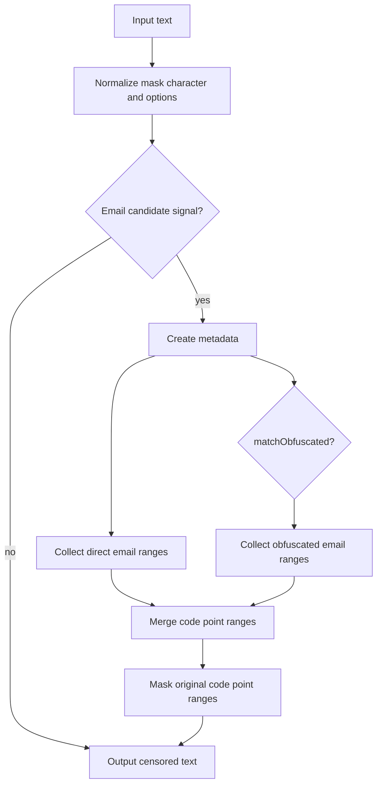
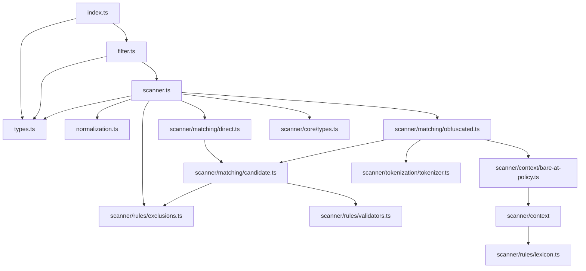

# Email Filter Architecture

## Goals

The package provides composable email censoring for direct addresses and common obfuscated address forms. It favors small deterministic scanner steps over broad regular expressions so matching stays predictable and false positives remain bounded.

## Public API

`createEmailFilter(options?)` creates an email censor with optional masking, matching, domain, and exclusion settings.

The default `filter` export is a shared instance with default domain rules. `emailFilter(options?)` is an alias for `createEmailFilter(options?)`.

`createEmailScanner(options?)` exposes the same matching behavior as a range scanner. `scanEmailRanges(text, options?)` returns code point ranges directly for callers that want to compose masking through `@textfilters/core`.

`EmailFilterOptions` supports:

- `maskChar`: the replacement character passed through core mask normalization;
- `matchObfuscated`: disables tokenized `at`/`dot` matching when set to `false`;
- `allowLocalhost`: allows `user@localhost`;
- `allowSingleLabelDomain`: allows other single-label domains such as `user@example`;
- `excludeEmails`: leaves matching full addresses unmasked;
- `excludeUsernames`: leaves matching local parts unmasked;
- `excludeDomains`: leaves matching domains and their subdomains unmasked.

## High-Level Flow

## Module Map

## File Responsibilities

| File or directory                       | Responsibility                                                                 | Out of scope                        |
| --------------------------------------- | ------------------------------------------------------------------------------ | ----------------------------------- |
| `src/index.ts`                          | Public entrypoint exports.                                                     | Scanner details.                    |
| `src/types.ts`                          | Public constants, options, filter types, and scanner contract types.           | Internal token and metadata shapes. |
| `src/normalization.ts`                  | Code point metadata, NFKC lowercase folding, and character predicates.         | Email matching policy.              |
| `src/scanner.ts`                        | Scanner factory, cheap prefilter, option normalization, and final range merge. | Tokenization and rule internals.    |
| `src/scanner/matching/direct.ts`        | Direct literal candidate discovery around `@`.                                 | Exclusions and boundary policy.     |
| `src/scanner/matching/obfuscated.ts`    | Optional obfuscated candidate discovery through the token stream.              | Public API construction or masking. |
| `src/scanner/matching/candidate.ts`     | Shared candidate validation, exclusions, and surrounding-boundary checks.      | Candidate discovery.                |
| `src/scanner/context/bare-at-policy.ts` | Bare `at` phrase policy for prose, labels, and accepted address lists.         | Direct `user@example.com` matching. |
| `src/scanner/context`                   | Introducer, label, phrase, and address-list helpers for bare `at` policy.      | Direct `user@example.com` matching. |
| `src/scanner/rules`                     | Local/domain validation, scanner lexicon, and exclusions.                      | Metadata construction.              |
| `src/scanner/core/types.ts`             | Shared internal token, punctuation, candidate, and scanner option types.       | Public types.                       |
| `src/filter.ts`                         | Factory, shared instance, alias, and code point masking orchestration.         | Tokenization and domain validation. |
| `tests/*.spec.ts`                       | Public behavior grouped by matching, contexts, prose guards, and integration.  | Exhaustive RFC email validation.    |

## Scanner Flow

Direct email scanning searches for normalized `@` characters, expands a local part to the left, expands a domain to the right, and emits an internal direct candidate. This path does not tokenize text and remains the small path for literal `user@example.com` matching.

Before metadata creation, the scanner checks for cheap direct or obfuscated email candidate signals. Clearly clean text returns no ranges without tokenization; candidate text still runs through the same direct, obfuscated, exclusion, and false-positive guards as before.

Obfuscated scanning is isolated under `src/scanner/matching/obfuscated.ts` and only runs when `matchObfuscated` is not `false`. It tokenizes words and separator tokens while ignoring whitespace around bracketed separators. It accepts `at`, `dot`, `@`, and `.` separator forms when they appear between a plausible local part and a valid dotted domain, then emits an internal obfuscated candidate.

Both paths pass candidates through `src/scanner/matching/candidate.ts`, which validates local part shape, domain labels, configured exclusions, a dotted TLD by default, and surrounding boundaries. `localhost` and other single-label domains are opt-in.

Bare `at` words and symbols use `src/scanner/context/bare-at-policy.ts` before candidate validation. That policy rejects prose-like phrase starts and resource phrases while preserving explicit email labels, introducers, and accepted obfuscated address lists.

## Exclusions

Exclusions are normalized with the same lowercase NFKC metadata used by the scanner. Full-address exclusions match the canonical `local@domain` form, username exclusions match the canonical local part, and domain exclusions match the exact canonical domain plus subdomains.

## Masking Behavior

Ranges are collected as code point indexes against the original source. Masking uses `@textfilters/core` code point helpers so astral characters are not split.

The default mask character is `*`. Custom mask characters are normalized to one JavaScript code unit where possible to keep direct replacements length-preserving.

## False-Positive Policy

The scanner intentionally avoids:

- package scopes such as `@textfilters/core`;
- social handles such as `@username`;
- prose-only `at` and `dot` words without a plausible local part;
- version-like text, decimals, and IP addresses;
- incomplete domains such as `user@example`;
- `user@localhost` unless configured.

## Change Guide

| Change                               | Primary files                                             |
| ------------------------------------ | --------------------------------------------------------- |
| Change public options                | `src/types.ts` + public API tests                         |
| Change direct email discovery        | `src/scanner/matching/direct.ts`                          |
| Change obfuscated separator handling | `src/scanner/matching/obfuscated.ts`                      |
| Change shared candidate acceptance   | `src/scanner/matching/candidate.ts`                       |
| Change bare `at` prose guards        | `src/scanner/context/bare-at-policy.ts` + context helpers |
| Change scanner vocabulary or rules   | `src/scanner/rules`                                       |
| Change normalization behavior        | `src/normalization.ts` + scanner tests                    |
| Change masking behavior              | `src/filter.ts` + invariant tests                         |

## Release Flow

Release Please manages releases from Conventional Commit history on `main`. The release workflow opens or updates release PRs, and when a Release Please release is created it runs checks and publishes the package to GitHub Packages. Release tags keep the `v*` pattern.

## Safety Rules

- Do not expose scanner internals as public API.
- Do not accept user-provided regular expressions.
- Do not match single-label domains by default.
- Do not update ranges after masking.
- Keep tests public-API oriented.
