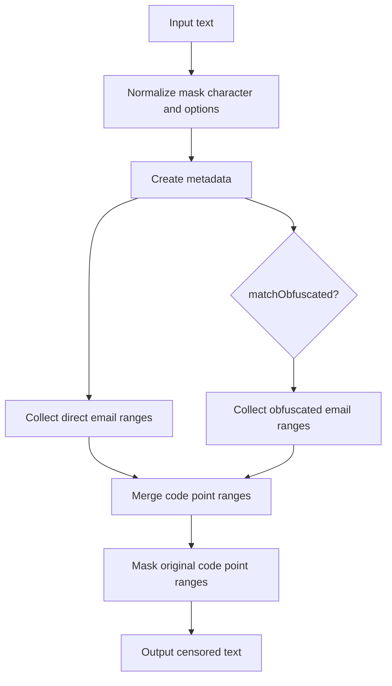
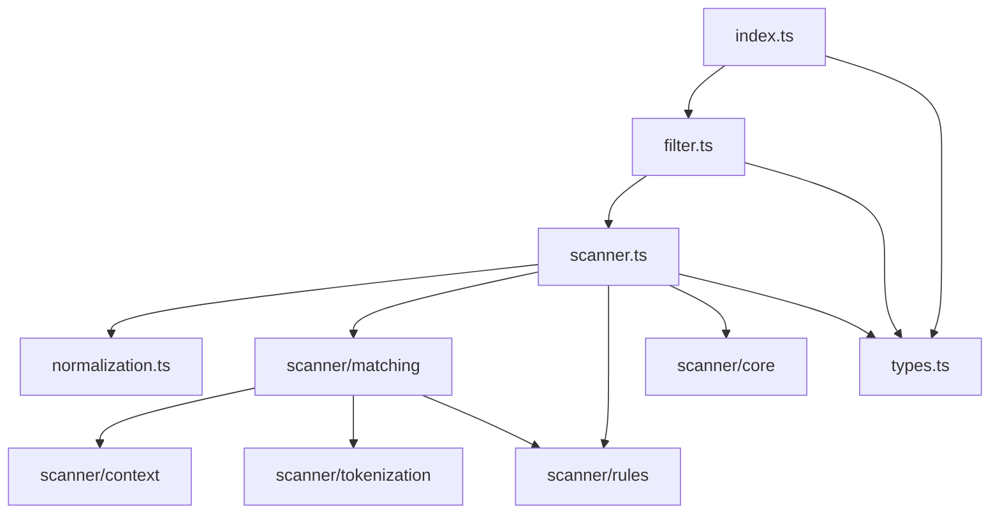

# Email Filter Architecture

## Goals

The package provides composable email censoring for direct addresses and common obfuscated address forms. It favors small deterministic scanner steps over broad regular expressions so matching stays predictable and false positives remain bounded.

## Public API

`createEmailFilter(options?)` creates an email censor with optional masking, matching, domain, and exclusion settings.

The default `filter` export is a shared instance with default domain rules. `emailFilter(options?)` is an alias for `createEmailFilter(options?)`.

`EmailFilterOptions` supports:

- `maskChar`: the replacement character passed through core mask normalization;
- `matchObfuscated`: disables tokenized `at`/`dot` matching when set to `false`;
- `allowLocalhost`: allows `user@localhost`;
- `allowSingleLabelDomain`: allows other single-label domains such as `user@example`;
- `excludeEmails`: leaves matching full addresses unmasked;
- `excludeUsernames`: leaves matching local parts unmasked;
- `excludeDomains`: leaves matching domains and their subdomains unmasked.

## High-Level Flow

## Module Map

## File Responsibilities

| File or directory      | Responsibility                                                                | Out of scope                        |
| ---------------------- | ----------------------------------------------------------------------------- | ----------------------------------- |
| `src/index.ts`         | Public entrypoint exports.                                                    | Scanner details.                    |
| `src/types.ts`         | Public constants, options, and filter types.                                  | Internal token and metadata shapes. |
| `src/normalization.ts` | Code point metadata, NFKC lowercase folding, and character predicates.        | Email matching policy.              |
| `src/scanner.ts`       | Scanner orchestration, option normalization, and final range merge.           | Tokenization and rule internals.    |
| `src/scanner/matching` | Direct literal address matching and optional obfuscated address matching.     | Public API construction or masking. |
| `src/scanner/rules`    | Local/domain validation, scanner lexicon, boundaries, and exclusions.         | Metadata construction.              |
| `src/scanner/context`  | Prose and introducer context for obfuscated `at` phrases.                     | Direct `user@example.com` matching. |
| `src/scanner/core`     | Shared internal token, punctuation, and scanner option types.                 | Public types.                       |
| `src/filter.ts`        | Factory, shared instance, alias, and code point masking orchestration.        | Tokenization and domain validation. |
| `tests/*.spec.ts`      | Public behavior grouped by matching, contexts, prose guards, and integration. | Exhaustive RFC email validation.    |

## Scanner Flow

Direct email scanning searches for normalized `@` characters, expands a valid local part to the left, expands a domain to the right, validates exclusions and label boundaries, and emits a range. This path does not tokenize text and remains the small path for literal `user@example.com` matching.

Obfuscated scanning is isolated under `src/scanner/matching/obfuscated.ts` and only runs when `matchObfuscated` is not `false`. It tokenizes words and separator tokens while ignoring whitespace around bracketed separators. It accepts `at`, `dot`, `@`, and `.` separator forms when they appear between a plausible local part and a valid dotted domain.

Both paths validate local part shape, domain labels, configured exclusions, a dotted TLD by default, and surrounding boundaries. `localhost` and other single-label domains are opt-in.

## Exclusions

Exclusions are normalized with the same lowercase NFKC metadata used by the scanner. Full-address exclusions match the canonical `local@domain` form, username exclusions match the canonical local part, and domain exclusions match the exact canonical domain plus subdomains.

## Masking Behavior

Ranges are collected as code point indexes against the original source. Masking uses `@textfilters/core` code point helpers so astral characters are not split.

The default mask character is `*`. Custom mask characters are normalized to one JavaScript code unit where possible to keep direct replacements length-preserving.

## False-Positive Policy

The scanner intentionally avoids:

- package scopes such as `@textfilters/core`;
- social handles such as `@username`;
- prose-only `at` and `dot` words without a plausible local part;
- version-like text, decimals, and IP addresses;
- incomplete domains such as `user@example`;
- `user@localhost` unless configured.

## Change Guide

| Change                               | Primary files                          |
| ------------------------------------ | -------------------------------------- |
| Change public options                | `src/types.ts` + public API tests      |
| Change direct email matching         | `src/scanner/matching/direct.ts`       |
| Change obfuscated separator handling | `src/scanner/matching/obfuscated.ts`   |
| Change prose false-positive guards   | `src/scanner/context`                  |
| Change scanner vocabulary or rules   | `src/scanner/rules`                    |
| Change normalization behavior        | `src/normalization.ts` + scanner tests |
| Change masking behavior              | `src/filter.ts` + invariant tests      |

## Release Flow

Release tags use the `v*` pattern. A tag push runs checks, publishes to GitHub Packages, and creates the GitHub Release for the same tag.

## Safety Rules

- Do not expose scanner internals as public API.
- Do not accept user-provided regular expressions.
- Do not match single-label domains by default.
- Do not update ranges after masking.
- Keep tests public-API oriented.
